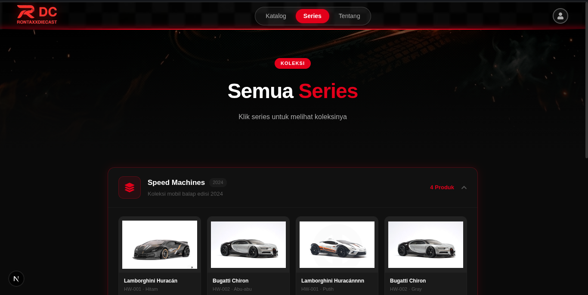
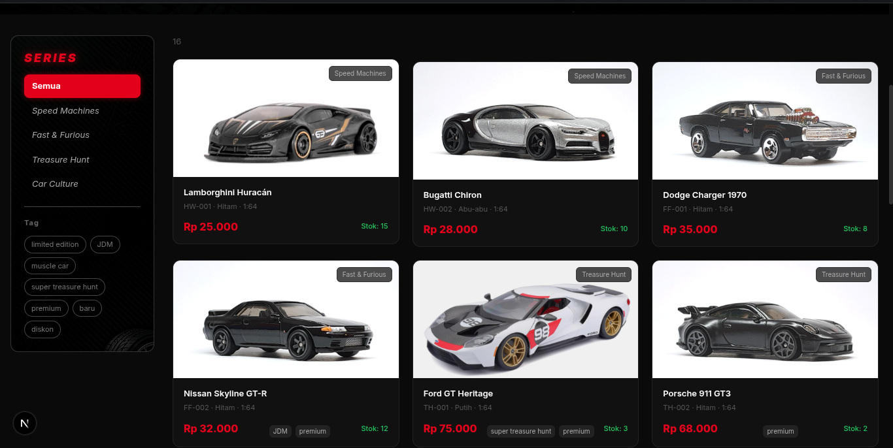

# Hotwheels Catalog

Website katalog koleksi Hotwheels modern berbasis Next.js dengan tampilan responsif, dashboard admin, dan manajemen data produk.

---

## Preview Website

### Homepage


### Dashboard Admin


### Series Page


### Product Dashboard


---

## Fitur Utama

- Menampilkan katalog mobil Hotwheels
- Halaman detail produk
- Dashboard admin
- Manajemen data produk
- Responsive design
- UI modern

---

## Tech Stack

- Next.js
- React.js
- Tailwind CSS
- Prisma ORM
- Database SQL

---

## Menjalankan Project Secara Lokal

Clone repository:

```bash
git clone https://github.com/username/hotwheels-catalog.git
cd hotwheels-catalog